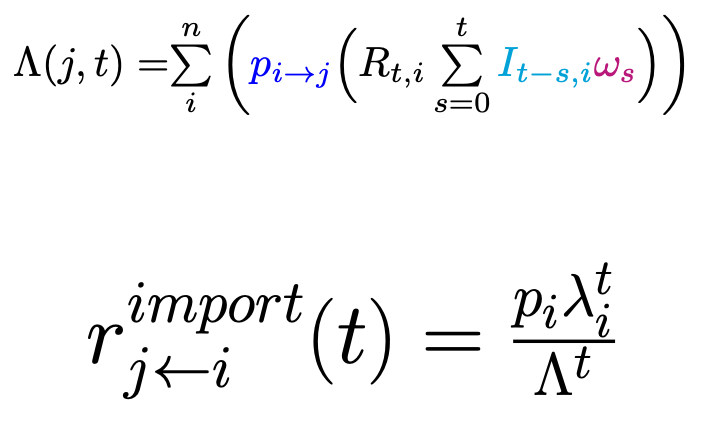

```{r setup, include=FALSE}
options(htmltools.dir.version = FALSE)
```

class: title-slide

# Using digital disease surveillance tools for near real-time epidemic forecasting

<br>
<h3> Sangeeta Bhatia<sup>a</sup>, Britta Lassmann<sup>b</sup>, Emily Cohn<sup>c</sup>, Malwina Carrion<sup>b, d</sup>,
Moritz U. G. Kraemer<sup>c, e, f</sup>, Mark Herringer<sup>g</sup>, John Brownstein<sup>c</sup>, Larry Madoff<sup>b</sup>, 
Anne Cori<sup>a</sup>, Pierre Nouvellet<sup>h</sup></h3>

<br>
<h4> [a] MRC Centre for Global Infectious Disease Analysis,Imperial
College London, <br> [b] ProMED, International Society for Infectious Diseases 
[c] Computational Epidemiology Group, Boston Children’s Hospital, <br>
[d] Department of Health Science, Sargent College
[e] Department of Zoology, Oxford University
[f] Department of Pediatrics, Harvard Medical School
 [g] healthsites.io, [h] Evolution, Behaviour and Environment, University of Sussex </h4>


---

# Project Partners
<br><br>


---
# Data collection is challenging

.center[]

---
# ProMED Mail
<br><br>


???
- The rapid growth of the internet has fostered a corresponding
  increase in tools for internet based disease detection and
  monitoring that lie at the other end of the spectrum.
- Program for Monitoring Emerging Diseases was one of the first
  entrants in the field of digital disease surveillance.
- ProMED reported in March 2014 on the likely spread of Zika to
  Americas, well before February 2015.
  
  
---

# HealthMap
<br><br>


???
- The surveillance data collected by HealthMap has been incorporated
  into the Epidemic Intelligence from Open Sources (EIOS) surveillance
  system, developed by WHO.
  

---
# Theoretical Framework
<br><br>


???
- Here I mainly talk about 1, 2, 3 reporting on a case study of this
  framework using data from West African Ebola epidemic.
---

# Raw Data
<br><br>


---
class: center, middle, animated, slideInRight
# Raw Data
<br><br>
]

---
class: center, middle, animated, slideInRight

#  Total Cases
<br><br>


---
class: center, middle, animated, slideInRight

#  Remove Duplicates
<br><br>


---
class: center, middle, animated, slideInRight
#  Remove Outliers
<br><br>


---
class: center, middle, animated, slideInRight
#  Make Non-Decreasing
<br><br>


---
class: center, middle, animated, slideInRight
#  Impute Missing Data
<br><br>


---
class: center, middle, animated, slideInRight
#  Daily Incidence Trends
<br><br>


---

# ProMED, HealthMap, and WHO: Incidence
<br><br>


???
- There were substantial differences between the incidence time series
  derived from the three data sources, particularly at the peak of the
  epidemic.
- Potential reasons - variability in digital surveillance reporting
- WHO data are a cleaned version, made available 1 year after the epidemic was over.
---

# Comparing R Estimates
<br><br>


???
- the time-varying transmissibility, measured by the reproduction
  number (the average number of secondary cases at time t per infected
  individual), were better correlated.
  
---
class: center
# Statistical Model
<br><br>

---

# Movement between spatial units
<br><br>
Approximated by a phenomenological model (e.g. gravity<sup>1</sup> or
radiation model<sup>2</sup>), or informed by other sources such as air
or road traffic data.

$$\phi_{i \rightarrow j} = \frac{N_i N_j}{d_{i, j}^{\gamma}}.$$

$$p_{i \rightarrow j} = (1 - p_{stay}^i)\frac{\phi_{i \rightarrow j}}{\sum_{x}{\phi_{i \rightarrow
  x}}}$$
  
.footnote[[1] Grosche, T., Rothlauf, F., & Heinzl, A. (2007). Gravity models for airline passenger volume estimation. Journal of Air Transport Management, 13(4), 175-183.

[2] Simini, F., González, M. C., Maritan, A., & Barabási, A. L. (2012). A universal model for mobility and migration patterns. Nature, 484(7392), 96.]

---

# Model Fitting & Forecasts
<br><br>
+ Model fitted to incidence data from all countries in Africa.

+ Model parameters - reproduction numbers for each country, distance
  exponent, and probability of staying - estimated using MCMC in R.
  
+ For forward simulations, transmissibility assumed to be constant
  over the forecast horizon.

+ Forecasts produce every 7th day, to simulate analysis carried out in 
an ongoing epidemic.

---

# Forecasts using ProMED Data
<br><br>


---

# Forecasts using HealthMap Data
<br><br>


---

# Model Performance: Accuracy
<br><br>


---

# Model Performance: Relative Error
<br><br>


---

# Model Performance: Bias
<br><br>


---

# Model Performance: Sharpness
<br><br>


---

# Model Performance
<br><br>


---

# Model Performance: ProMED, HealthMap and WHO
<br><br>


---
# Model Performance

+ Variable model performance in predicting the number of cases.

+ Better at short forecast horizons, becomes worse as forecasts are
made over longer horizons.

---

# Risk of Spatial Spread

+ For each week and each country in Africa, generated an alert if the
  predicted incidence (a predetermined percentile of the forecast
  interval) was greater than 0. 
  
+ True alert - if observed incidence is non-zero, false is alert was
  raised but no cases observed in that week, missed alert if there
  were cases but no alert was raised. 
  
  


---
# Risk of Spatial Spread: ROC Curve
<br><br>


??? 
- our model achieved high sensitivity but variable specificity
- sensitivity of the model remained high over longer forecast horizon
  while the specificity deteriorated,
- more false alerts being raised 4 week ahead
---

# Risk of Spatial Spread 
<br><br>


---
# Risk of Importation

.center[]

---
# Risk of Importation
<br><br>


---

# Conclusion
<br><br> 
+ Variable performance in predicting number of cases.

+ Scope for model improvement - different mobility models, increase
  model complexity, more data on human movement.
  
+ Model performed very well in predicting risk of spatial spread.

+ Correctly attributed high risk of importation to source country.

+ First demonstration of using data from two widely used digital 
  surveillance tools for epidemic forecasting.
  
---
# Conclusion

.pull-left[] 
.pull-right[]

---
# Pre-print and more information

.center[]
.pull-left[[`r icon::fa("github")` `sangeetabhatia03`](https://github.com/sangeetabhatia03)]
.pull-right[[`r icon::fa("twitter")` `sangeeta0312`](https://twitter.com/sangeeta0312)]
