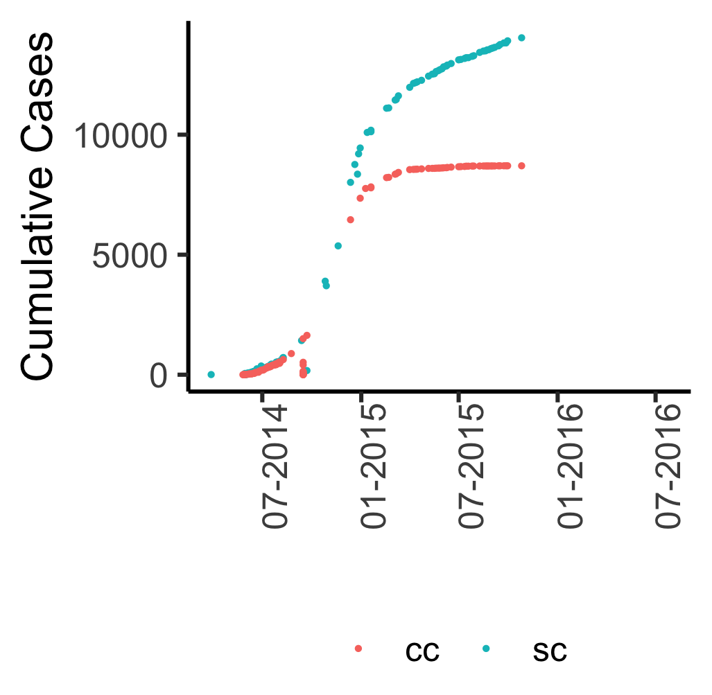

```{r setup, include=FALSE}
options(htmltools.dir.version = FALSE)
```

class: title-slide

# Using digital disease surveillance tools for near real-time epidemic forecasting

<br>
<h3> Sangeeta Bhatia<sup>a</sup>, Britta Lassmann<sup>b</sup>, Emily Cohn<sup>c</sup>, Malwina Carrion<sup>b, d</sup>,
Moritz U. G. Kraemer<sup>c, e, f</sup>, Mark Herringer<sup>g</sup>, John Brownstein<sup>c</sup>, Larry Madoff<sup>b</sup>, 
Anne Cori<sup>a</sup>, Pierre Nouvellet<sup>h</sup></h3>

<br>
<h4> [a] MRC Centre for Global Infectious Disease Analysis,Imperial
College London, <br> [b] ProMED, International Society for Infectious Diseases 
[c] Computational Epidemiology Group, Boston Children’s Hospital, <br>
[d] Department of Health Science, Sargent College
[e] Department of Zoology, Oxford University
[f] Department of Pediatrics, Harvard Medical School
 [g] healthsites.io, [h] Evolution, Behaviour and Environment, University of Sussex </h4>


---

# Project Partners


---
# ProMED Mail


---

# HealthMap


---
# Theoretical Framework


---

# Raw Data


---
class: center, middle, animated, slideInRight
# Raw Data

]

---
class: center, middle, animated, slideInRight

#  Total Cases


---
class: center, middle, animated, slideInRight

#  Remove Duplicates


---
class: center, middle, animated, slideInRight
#  Remove Outliers


---
class: center, middle, animated, slideInRight
#  Monotonically Increasing


---
class: center, middle, animated, slideInRight
#  Impute Missing Data


---
class: center, middle, animated, slideInRight
#  Daily Incidence Trends


---

# ProMED, HealthMap, and WHO: Incidence


---

# Comparing R Estimates


---
class: center
# Statistical Model


---

# Movement between spatial units

Approximated by a phenomenological model (e.g. gravity<sup>1</sup> or
radiation model<sup>2</sup>), or informed by other sources such as air
or road traffic data.

$$\phi_{i \rightarrow j} = \frac{N_i N_j}{d_{i, j}^{\gamma}}.$$

$$p_{i \rightarrow j} = (1 - p_{stay}^i)\frac{\phi_{i \rightarrow j}}{\sum_{x}{\phi_{i \rightarrow
  x}}}$$
  
.footnote[[1] Grosche, T., Rothlauf, F., & Heinzl, A. (2007). Gravity models for airline passenger volume estimation. Journal of Air Transport Management, 13(4), 175-183.

[2] Simini, F., González, M. C., Maritan, A., & Barabási, A. L. (2012). A universal model for mobility and migration patterns. Nature, 484(7392), 96.]

---

# Model Fitting & Forecasts

+ Model fitted to incidence data from all countries in Africa.

+ Model parameters - reproduction numbers for each country, distance
  exponent, and probability of staying - estimated using MCMC in R.
  
+ For forward simulations, transmissibility assumed to be constant
  over the forecast horizon.

+ Forecasts produce every 7th day, to simulate analysis carried out in an ongoing epidemic.

---

# Forecasts using ProMED Data


---

# Forecasts using HealthMap Data


---

# Model Performance: Accuracy


---

# Model Performance: Relative Error


---

# Model Performance: Bias


---

# Model Performance: Sharpness


---

# Model Performance


---

# Model Performance: ProMED, HealthMap and WHO


---

# Risk of Spatial Spread: ROC Curve


---

# Risk of Spatial Spread 


---

# Risk of Importation


---

# Conclusion

+ Variable performance in predicting number of cases.

+ Scope for model improvement - different mobility models, increase
  model complexity, more data on human movement.
  
+ Model performed very well in predicting risk of spatial spread.

+ First demonstration of using data from two widely used digital surveillance
  tools for epidemic forecasting.
  
---
# Conclusion

.pull-left[] 
.pull-right[]

---
# Pre-print and more information

.center[]
.pull-left[[`r icon::fa("github")` `sangeetabhatia03`](https://github.com/sangeetabhatia03)]
.pull-right[[`r icon::fa("twitter")` `sangeeta0312`](https://twitter.com/sangeeta0312)]
